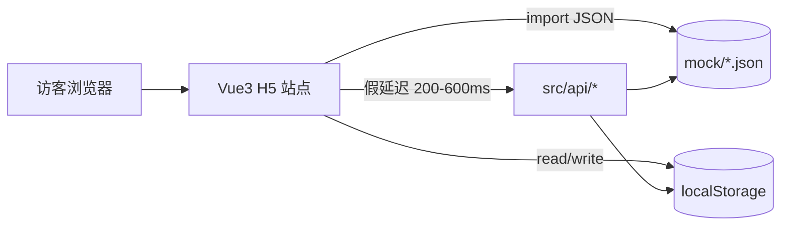

# aitee — AI T 恤/帆布包定制小程序 开发计划

> 来源：`C:\Users\admin\Desktop\开发说明.docx` + 用户提供的 10 张参考图（前 5 张为首页）
> 项目代号：**aitee**（中文品牌名待定，本文档暂用占位「AI Tee」）
> 创建于：2026-05-21；最后更新：2026-05-21（第一阶段调整为前端 Demo 优先）
> 注意：参考图中的「须鱼定制」logo / 主视觉 / IP 名属于竞品，本项目不复用，仅作版式参考

## 一、阶段拆分（重要）

为了能尽快给客户演示，整体拆成两阶段：

- **阶段 1（先做）—— 前端 H5 静态 Demo**
  - 纯 Vue 3 + Vite，浏览器直接打开就能看
  - 全部 10+ 页面 UI 与跳转，所有数据本地 mock
  - 重点：视觉过得去 + 交互流畅 + 编辑器可拖拽
  - 目标：客户开链接看，相当于一个高保真原型

- **阶段 2（后做）—— 后端 + 真实数据 + 微信小程序版**
  - 接 FastAPI 后端，把 mock 替换成真实 API
  - 加微信登录、模拟支付、总部后台
  - 视情况把前端从 Vue3 H5 切到 uniapp（一份代码出 H5 + 小程序）

**本文档以下章节均针对阶段 1。** 阶段 2 的方案另行起计划文档。

## 二、技术栈

- **框架**：Vue 3 + TypeScript + Vite 5
- **路由**：Vue Router 4（hash 模式，方便静态部署到任意路径）
- **状态**：Pinia
- **UI 组件**：Vant 4（移动端，组件全、文档好、与设计稿风格契合）
- **视口适配**：`postcss-px-to-viewport-8-plugin`（设计稿宽 375，运行按视口缩放）
- **图标**：`unplugin-icons` + `@iconify-json/material-symbols`（按需加载，无字体文件包）
- **编辑器交互**：纯 DOM + CSS `transform` 实现拖拽 / 缩放 / 旋转，配合 `@vueuse/core` 的 `useDraggable` / `usePointer`（足够 Demo 用；阶段 2 真出图时再考虑 konva / fabric.js）
- **mock 数据**：`src/mock/*.json` + `src/api/*.ts`（API 函数返回 `Promise<T>`，结构与阶段 2 真实接口一致，切换时只改 `api/` 实现）
- **离线占位图**：本地 `assets/placeholders/` 下放一组 SVG/PNG 占位，避免依赖外网图床
- **不引入**：jQuery、UI 模板、第三方 H5 设计器（保持轻量）

## 三、运行与演示

```bash
cd D:\wp\waibao\aitee\frontend
npm install
npm run dev          # 本地 http://localhost:5173 （Ctrl+点链接打开）
npm run build        # 产物在 dist/，任意静态服务器即可托管
npm run preview      # 本地预览生产产物
```

演示给客户三种方式：
1. **本地最快**：`npm run dev` 后浏览器 F12 切到移动设备模拟（iPhone 12 Pro / 375x812）
2. **手机扫码**：`npm run dev -- --host`，手机连同一 WiFi 扫终端二维码
3. **静态部署**：`npm run build` 产物丢到内网任何目录或 Nginx，发链接给客户即可

## 四、目录结构

```
D:\wp\waibao\aitee\
├── frontend\
│   ├── src\
│   │   ├── api\                  # mock API（与阶段 2 真实接口同签名）
│   │   │   ├── request.ts        # 模拟网络延迟封装
│   │   │   ├── home.ts           # banners / 推荐位 / 限时券
│   │   │   ├── product.ts        # 款式
│   │   │   ├── pattern.ts        # 印花 + 分类
│   │   │   ├── design.ts         # 我的设计
│   │   │   ├── cart.ts           # 购物车
│   │   │   ├── order.ts          # 订单
│   │   │   ├── address.ts        # 地址
│   │   │   ├── coupon.ts         # 优惠券
│   │   │   ├── ai.ts             # AI 出图（返回示例图）
│   │   │   └── user.ts           # 用户资料
│   │   ├── mock\                 # 静态 JSON 数据
│   │   │   ├── banners.json
│   │   │   ├── products.json     # 3 T 恤款 + 1 帆布包 + 1 卫衣 + 1 亲子装
│   │   │   ├── pattern-categories.json
│   │   │   ├── patterns.json     # ~30 张占位印花
│   │   │   ├── recommend.json    # 人气推荐 6 卡片
│   │   │   ├── topics.json       # 4-5 个横滑专区
│   │   │   ├── orders.json       # 3 条示例订单（不同状态）
│   │   │   ├── designs.json      # 2 条示例设计
│   │   │   ├── addresses.json
│   │   │   ├── coupons.json      # 1 张新人 7.8 折券
│   │   │   └── ai-samples.json   # AI 出图占位结果
│   │   ├── assets\
│   │   │   ├── logo\             # aitee 文字 logo（SVG）
│   │   │   ├── placeholders\     # T 恤底图、印花、Banner 占位 SVG/PNG
│   │   │   ├── icons\            # tabbar 图标
│   │   │   └── styles\
│   │   │       ├── variables.scss   # 颜色 / 字号 / 间距
│   │   │       └── global.scss
│   │   ├── components\
│   │   │   ├── AppTabbar.vue        # 自定义 5 项 tabbar，中间凸起按钮
│   │   │   ├── NavBar.vue           # 通用顶部栏（返回 + 标题 + 右操作）
│   │   │   ├── Countdown.vue        # 限时倒计时 hh:mm:ss
│   │   │   ├── ProductCard.vue
│   │   │   ├── PatternCard.vue
│   │   │   ├── BannerCarousel.vue
│   │   │   ├── ColorSwatch.vue      # 颜色色块选择
│   │   │   ├── EditorCanvas.vue     # 编辑器画布（含图层渲染）
│   │   │   ├── EditorLayer.vue      # 单图层（拖/缩/转/删）
│   │   │   ├── EditorToolbar.vue    # 4 工具按钮
│   │   │   └── EmptyState.vue
│   │   ├── pages\
│   │   │   ├── home\index.vue                    # 首页
│   │   │   ├── gallery\index.vue                 # 印花库
│   │   │   ├── editor\index.vue                  # 定制编辑器（核心）
│   │   │   ├── product-picker\index.vue          # 款式选择
│   │   │   ├── cart\index.vue                    # 购物车
│   │   │   ├── checkout\index.vue                # 结算页（地址/优惠券/合计）
│   │   │   ├── mine\index.vue                    # 我的
│   │   │   ├── order\list.vue                    # 订单列表（tab 切换状态）
│   │   │   ├── order\detail.vue                  # 订单详情
│   │   │   ├── design-list\index.vue             # 我的设计
│   │   │   ├── address\list.vue                  # 地址列表
│   │   │   ├── address\edit.vue                  # 新增/编辑地址
│   │   │   ├── coupon\index.vue                  # 优惠券
│   │   │   ├── login\index.vue                   # 登录占位（一键体验登录）
│   │   │   ├── ai-create\index.vue               # AI 创作浮层/页面
│   │   │   └── upload\index.vue                  # 来图定制结果
│   │   ├── router\index.ts
│   │   ├── store\
│   │   │   ├── user.ts             # 登录态（mock）
│   │   │   ├── editor.ts           # 编辑器图层 + 历史记录（撤销/重做）
│   │   │   ├── cart.ts             # 购物车
│   │   │   └── order.ts            # 临时订单（结算用）
│   │   ├── utils\
│   │   │   ├── delay.ts            # sleep
│   │   │   ├── id.ts               # 生成订单号 / id
│   │   │   ├── format.ts           # 价格 / 时间格式化
│   │   │   └── storage.ts          # localStorage 包装（订单/设计稿持久化）
│   │   ├── App.vue
│   │   └── main.ts
│   ├── public\
│   │   ├── favicon.svg
│   │   └── logo.svg
│   ├── index.html
│   ├── package.json
│   ├── tsconfig.json
│   ├── vite.config.ts
│   └── README.md                   # 本地启动 + 演示说明
├── doc\                            # 需求文档归档、参考截图
└── README.md
```

## 五、页面清单与要点（共 16 个路由，覆盖完整闭环）

| 路由 | 页面 | 关键交互 / 数据来源 |
|---|---|---|
| `/` | **首页** | 主视觉占位 + 5 入口 + 倒计时（Countdown）+ 人气推荐 2x3 + 4 横滑专区。数据来自 `mock/banners`、`recommend`、`topics`。点击「定制」入口或 tabbar 中央按钮 → `/editor` |
| `/gallery` | **印花库** | 顶部分类 tab 横滑 + 双列瀑布流。数据 `mock/pattern-categories`、`patterns`。点击印花 → `/editor?patternId=xxx`，自动加入图层 |
| `/editor` | **定制编辑器** | 核心：T 恤底图 + 颜色色块（白/黑/粉/紫）+ 图层（拖/缩/转/删/层级）+ 正反面切换 + 撤销/重做（pinia 历史栈）+ 4 工具（印花库/文字/来图/AI）+ 切换款式 + 保存设计稿（写 `localStorage` + `store/editor`）|
| `/product-picker` | **款式选择** | 标签筛选 + 款式卡片 + 颜色 + 「使用此款式」。从编辑器顶部「切换款式」进入，选择后回填 |
| `/cart` | **购物车** | 全选 / 单选 / 加减 / 删除 / 总价。底部「结算」→ `/checkout` |
| `/checkout` | **结算页** | 地址、商品列表、优惠券、合计、「提交订单」（mock 支付：3s 后跳订单详情 `pending_print`）|
| `/mine` | **我的** | 头像 + 占位手机号、优惠券入口、我的设计、我的订单（4 状态横滑）、我的图库、地址、客服、邀请 banner |
| `/order/list` | **订单列表** | 顶部 4 tab：全部 / 待付款 / 待发货 / 已完成 |
| `/order/:id` | **订单详情** | 状态时间线 + 商品 + 地址 + 价格明细 + 「再来一单」 |
| `/design-list` | **我的设计** | 设计稿网格，点击进入编辑器 |
| `/address/list` | **地址列表** | 增/删/默认 |
| `/address/edit` | **地址编辑** | 表单 |
| `/coupon` | **优惠券** | tab：未使用 / 已使用 / 已过期 |
| `/login` | **登录** | 「一键体验登录」按钮，写假 token 进 store/localStorage |
| `/ai-create` | **AI 创作** | 输入描述 + 选风格 + 「生成」按钮 → 3s 后从 `mock/ai-samples` 随机返回 4 张示例 → 选一张回到编辑器 |
| `/upload-result` | **来图定制** | 选本地图（`<input type=file>`）→ 显示在编辑器图层 |

## 六、视觉风格规范

- 主色：`#FF4D4F`（橙红，CTA / 价格 / 选中）
- 辅色：`#1F2937`（深灰文字）、`#F5F5F5`（卡片底）、`#FFFFFF`（页面底）
- 强调色：`#22C55E`（绿色，仅用于成功状态 / 价签）
- 字体：系统字体栈，标题 600，正文 400
- 圆角：`8px / 12px`（卡片）、`24px`（胶囊按钮）、`9999px`（头像 / 颜色色块）
- 阴影：`0 2px 8px rgba(0,0,0,0.06)`
- 间距：4 / 8 / 12 / 16 / 24 八点制
- Logo：阶段 1 用纯文字 SVG `aitee`（橙红粗体），不使用任何与竞品相似的图形

## 七、Mock 数据规模与持久化

- 启动初始化：从 `src/mock/*.json` 同步加载到 pinia
- 用户行为（加购物车、保存设计、下单、改地址）→ 写 `localStorage`，刷新不丢
- 「重置 Demo」按钮：清空 localStorage + 重载（放在我的页面底部，演示完一键复原）
- mock 网络延迟：`request.ts` 默认 sleep `200~600ms`，模拟真实加载

## 八、整体数据流（阶段 1）



## 九、实施 todos（阶段 1）

| # | ID | 内容 |
| - | -- | ---- |
| 1 | scaffold | 在 `D:\wp\waibao\aitee\frontend` 下用 `npm create vite@latest` 起 Vue+TS 模板，装 `vue-router`、`pinia`、`vant`、`@vueuse/core`、`postcss-px-to-viewport-8-plugin`、`unplugin-icons`、`sass`，配 `vite.config.ts`、`postcss`、全局 scss 变量、视口插件 |
| 2 | layout | 实现 `App.vue` 路由出口 + 自定义 `AppTabbar`（5 项，中间凸起 logo 按钮，仅在 `/`、`/gallery`、`/cart`、`/mine` 显示）+ `NavBar` 通用顶部栏 |
| 3 | mock-and-api | 写 `mock/*.json`（含 ~30 张占位印花、6 个款式、3 条订单等）+ `api/*.ts`（模拟延迟 + 增删改查，写 localStorage）+ pinia store 骨架 |
| 4 | placeholders | 制作 / 整理一套占位 SVG/PNG：aitee logo、5 入口图标、tabbar 图标、T 恤底图（白/黑/粉/紫 4 色）、帆布包底图、印花占位、Banner 占位 |
| 5 | page-home | 首页：品牌栏、主视觉、5 入口、限时券倒计时、人气推荐 2x3、4 横滑专区，全部数据从 mock 拉 |
| 6 | page-gallery | 印花库：顶部分类 tab 横滑 + 双列瀑布流，点印花 → 跳编辑器并自动加入图层 |
| 7 | page-editor | **核心** 定制编辑器：T 恤底图 + 颜色 + 图层（拖/缩/转/删/层级）+ 正反 + 撤销/重做 + 4 工具栏 + 切换款式 + 保存设计 |
| 8 | page-product-picker | 款式选择弹窗页：标签筛选 + 卡片 + 颜色 + 使用此款式回到编辑器 |
| 9 | page-cart-checkout | 购物车 + 结算页（mock 支付 3s 后跳订单详情 `pending_print`）|
| 10 | page-mine-orders | 我的 + 订单列表（4 状态 tab）+ 订单详情（状态时间线）|
| 11 | page-address-coupon-design | 地址列表/编辑、优惠券、我的设计、登录占位 |
| 12 | page-ai-upload | AI 创作页（输入描述选风格 → 3s 后 mock 出图）+ 来图定制（本地选图 → 进编辑器图层）|
| 13 | polish | 视觉打磨：空状态、loading、过渡动画；首屏速度；移动端真机验证；README 写演示步骤 |

## 十、待确认事项（不阻塞起步）

1. **中文品牌名**：`aitee` 是项目代号，UI 上中文名暂用「AI Tee」。
2. **品牌 logo / 主色**：阶段 1 用纯文字 logo + `#FF4D4F` 主色占位。
3. **演示部署**：阶段 1 跑 `npm run dev` 即可；如果要发链接给客户在线看，告诉我用什么环境（你电脑公网映射 / 内网域名 / Vercel / 其它）。
4. **素材**：所有占位图自制为简洁 SVG，避免侵权；若你后续提供正式素材，替换 `assets/placeholders/` 即可。
